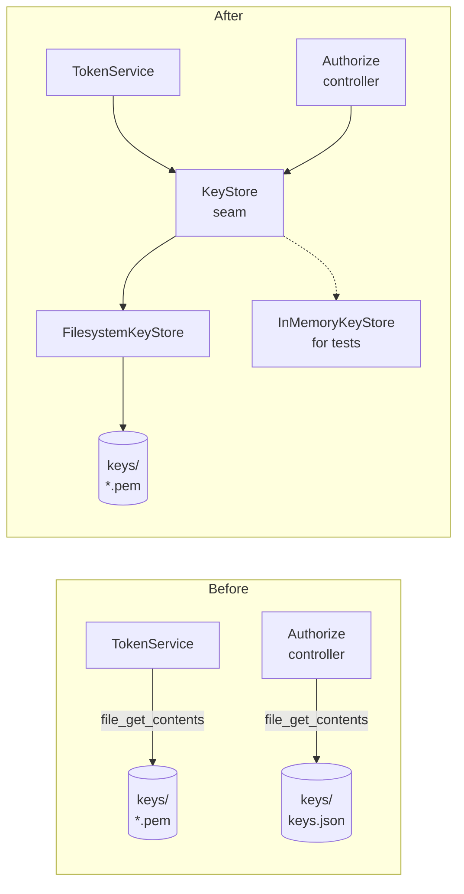
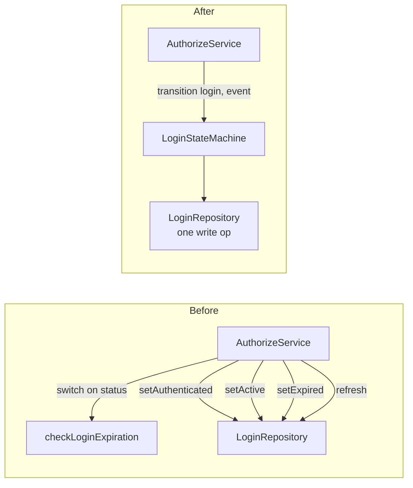
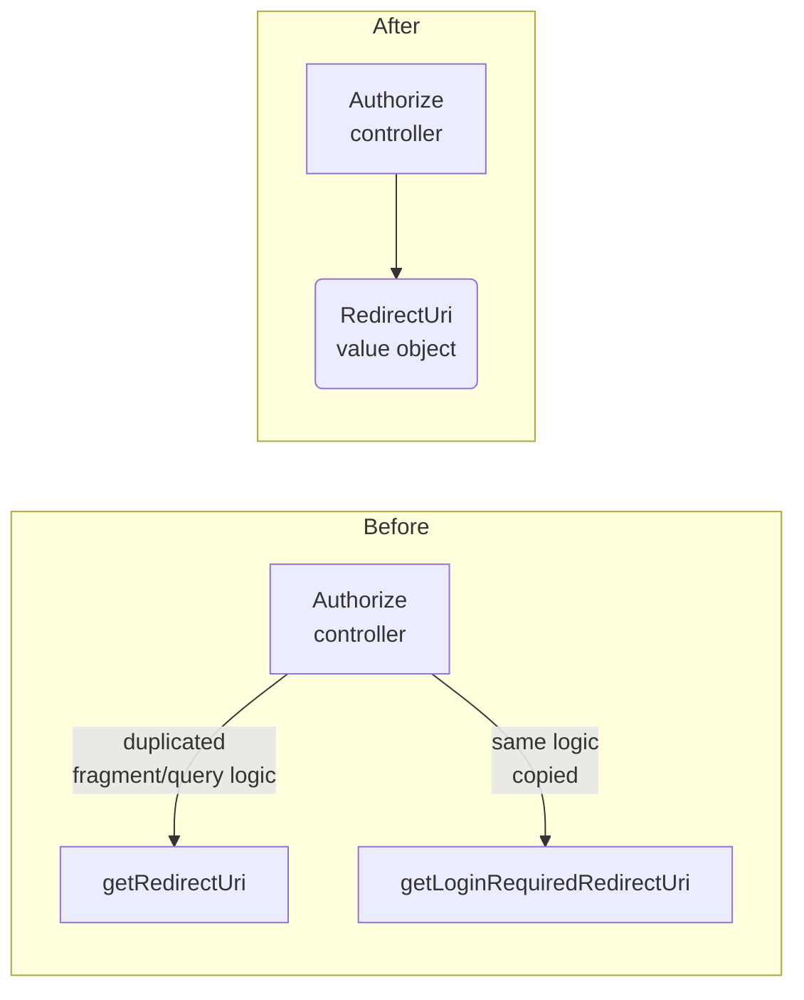
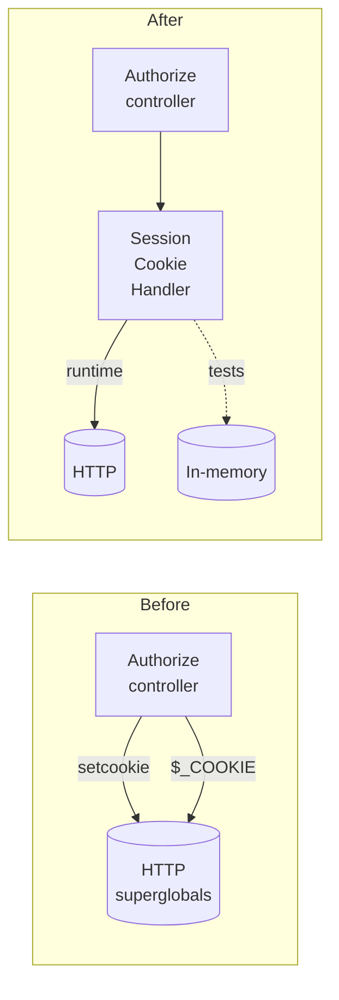

# Architecture Review — php-auth

_2026-07-12_

## Candidates

### Extract a KeyStore module behind a seam

**Strength:** Strong

**Files:** `src/services/token_service.php`, `src/controllers/authorize.php`

**Problem:** Key loading (RSA key pairs, JWKS, certificates) is raw `file_get_contents()` calls repeated across TokenService (validate, create, createKeys) and Authorize::sendKeys — no seam, impossible to test without keys on disk.

**Solution:** Introduce a KeyStore module with a `FindKeys(kid): KeySet` interface. A FilesystemKeyStore adapter replaces the current four scattered reads. An InMemoryKeyStore adapter enables token tests without touching the filesystem.

**Wins:**
- TokenService loses filesystem dependency — testable without keys
- Key creation (`createKeys`) moves to setup scope, not mixed with token ops
- One adapter per runtime env today, a second adapter makes the seam real

---

### Consolidate the Login state machine

**Strength:** Strong

**Files:** `src/services/authorize_service.php`, `src/repositories/login_repository.php`, `src/interfaces/login_repository.php`, `src/models/login.php`

**Problem:** The Login entity transitions through `PENDING → AUTHENTICATED → ACTIVE → EXPIRED` with TTL-based expiry per status, but transition rules are split across `AuthorizeService::checkLoginExpiration()` (a switch on status with expiry logic) and five separate `LoginRepository` methods (`setAuthenticated`, `setActive`, `setExpired`, `refresh`). Understanding "what happens when a login expires" requires reading both files.

**Solution:** Concentrate all login state transition rules — valid transitions, per-status TTL checks, and side effects — behind a single `LoginStateMachine` module. Callers submit a `(Login, Event)` pair and receive a new `Login` or an error.

**Wins:**
- All transitions and expiry rules in one place — locality for bugs and changes
- Interface shrinks from 5 repository methods to 1 state-machine method
- Tests verify the state diagram without touching the database
- Login model no longer needs hidden status semantics

---

### Extract redirect URI construction into a value object

**Strength:** Worth exploring

**Files:** `src/controllers/authorize.php`

**Problem:** Two methods (`getRedirectUri`, `getLoginRequiredRedirectUri`) in the Authorize controller share the same logic for appending query vs fragment parameters to a redirect URI, including handling of existing fragments. The logic is duplicated, tested only via E2E, and lives in the HTTP handler where it doesn't belong.

**Solution:** Introduce a `RedirectUri` value object that accepts the base URI, response mode, and query parameters, and produces the correctly-formed URI regardless of mode. Both the success and error paths use it.

**Wins:**
- URI construction isolated — pure function, trivially testable
- Controller loses infrastructure detail
- Error and success paths converge on one module

---

### Decouple session cookie handling from the controller

**Strength:** Worth exploring

**Files:** `src/controllers/authorize.php`

**Problem:** Session cookie encode/decode/set/delete is inline in the Authorize controller via `setSessionCookie`, `deleteSessionCookie`, and `getSessionIdFromCookie`. The cookie format (`{realm}\{session_id}`) and `$_COOKIE`/`setcookie()` calls are infrastructure that forces any test to mock HTTP superglobals.

**Solution:** Extract a `SessionCookieHandler` adapter behind a narrow seam: `read(realm): ?session_id`, `write(realm, session_id)`, `delete(realm)`. The controller calls it; tests swap it for an in-memory adapter.

**Wins:**
- Controller tests no longer need `$_COOKIE` or `setcookie`
- Cookie format documented in one place, not three
- Seam becomes real when a second adapter exists

---

## Top recommendation

**Extract a KeyStore module** — it has the highest leverage (four filesystem reads collapsed into one seam) and unblocks testing the token flow, which is the security-critical path. TokenService cannot be tested in isolation today; a KeyStore seam is the smallest change that fixes that.
